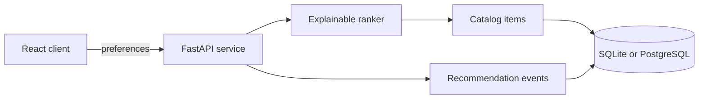

# JewelRank — Explainable Jewelry Recommendation Platform

JewelRank is a clean-room, full-stack recommendation system built around transparent ranking rather than opaque product claims. It combines a FastAPI service, SQLAlchemy persistence, a deterministic synthetic catalog, and a React/TypeScript interface.

This repository is an independent portfolio implementation by Yila Cao. It does not copy the earlier team repository's frontend, shared dataset, product images, credentials, or Git history.

## What it demonstrates

- **Recommendation engineering:** configurable style, color, and segment signals with a per-result explanation.
- **Backend design:** typed request contracts, validation, persistence, idempotent catalog seeding, and analytics endpoints.
- **Data modeling:** separate catalog and recommendation-event tables with SQLite locally and PostgreSQL support for deployment.
- **Full-stack integration:** a responsive React/TypeScript client consuming a versioned API contract.
- **Reproducibility:** synthetic brand-neutral data, deterministic ranking, automated tests, Docker configuration, and CI.

## System design



The scoring function is intentionally explicit:

```text
score = 0.55 × style_match + 0.30 × color_match + 0.15 × segment_match
```

When a preference is omitted, that signal receives a neutral value instead of silently excluding products. Results are filtered by price and optional category, then sorted deterministically by score, price, and SKU.

## Quick start

### Backend

```bash
python -m venv .venv
source .venv/bin/activate
pip install -e '.[dev]'
uvicorn jewelrank.api:app --reload
```

Open the interactive API documentation at <http://localhost:8000/docs>.

### Frontend

```bash
cd web
npm install
npm run dev
```

The web client uses `http://localhost:8000` by default. Set `VITE_API_URL` for another deployment.

### Docker with PostgreSQL

```bash
docker compose up --build
```

The credentials in `compose.yaml` are local-development defaults only. Production deployments must use managed secrets and a unique database role.

## API example

```bash
curl -X POST http://localhost:8000/recommend \
  -H 'Content-Type: application/json' \
  -d '{"styles":["modern"],"colors":["black"],"category":"ring","limit":3}'
```

Each result includes the total score and separate style, color, and segment components.

## Repository structure

```text
src/jewelrank/       API, database, catalog, and ranking packages
tests/               backend contract and ranking tests
web/                 independent React/TypeScript client
.github/workflows/   backend and frontend CI
compose.yaml         local PostgreSQL deployment
```

## Verification

```bash
ruff check .
pytest
cd web && npm ci && npm run build
```

CI runs the same checks for every push and pull request.

## Data and privacy

The catalog is generated deterministically in code and contains no scraped products, customer records, proprietary images, or private company material. The service stores only submitted preference fields and aggregate recommendation metadata in the local database. Image upload and third-party generative-AI calls are deliberately out of scope for this version.

## Limitations and next steps

- The synthetic catalog validates the system design but is not evidence of commercial recommendation quality.
- Offline evaluation against real user feedback would require a consented, licensed dataset and a predeclared metric protocol.
- Authentication, per-user histories, migrations, and production observability are natural next increments.
- A deployed demo should be linked only after the API and frontend are tested together in production.

## Authorship

Designed and independently implemented by **Yila Cao** in 2026 as a clean portfolio rebuild informed by lessons from an earlier collaborative database-and-ML course project. No collaborator-owned implementation or private employer code is included.

## License

MIT License. See [`LICENSE`](LICENSE).
